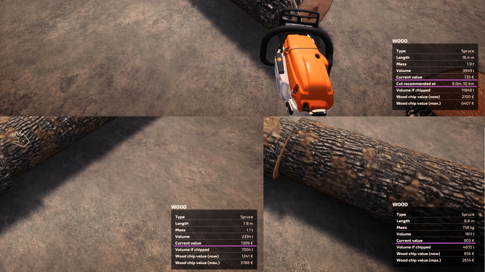
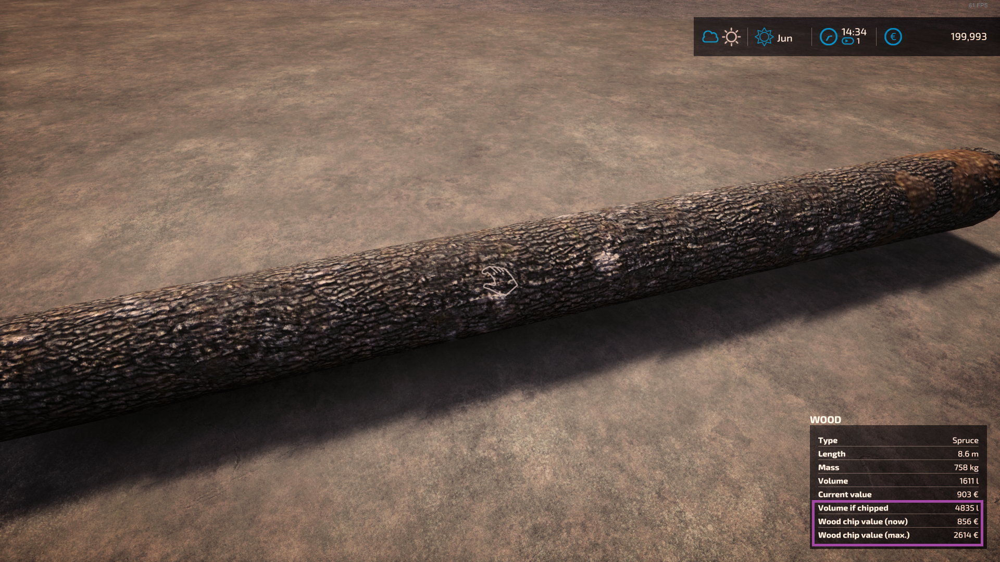

# FS25 Forestry Helper

## Mod description

This mod provides helpful information on trees and logs and helps in making cuts at precise length intervals.

Detailed info on quality, value and wood chip potential. Visible with or without chainsaw:

Feedback on factors which reduce the sell price:

Compatibility with [Info Display Extension](https://github.com/Achimobil/FS22_InfoDisplayExtension):

Indicator which helps cutting at desired lengths (it also snaps the chainsaw to it when close):

Info displayed in wood harvesters: (no quality info since that will change when cutting anyway).

The modhub icon is built from:
- [Chainsaw icons created by Good Ware - Flaticon](https://www.flaticon.com/free-icons/chainsaw)
- [Construction and tools icons created by juicy_fish - Flaticon](https://www.flaticon.com/free-icons/construction-and-tools)

## How to install

1. Download the newest zip from the [Releases page](https://github.com/Timmeey86/FS25_ForestryHelper/releases)
1. Place the zip file in your FS25 mod folder
1. Start the game and use like any other mod

## How to debug/code

1. Obviously, own a copy of Farming Simulator 25
1. Clone this folder anywhere
1. Use Visual Code with at least the Lua Language Server Plugin for coding
1. When testing, execute copytofs.bat within the VSCode terminal and open that mod folder in Giants Studio
1. Debug in Giants Studio